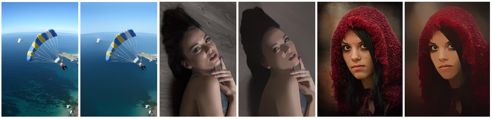
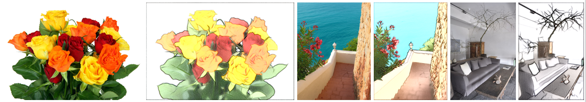
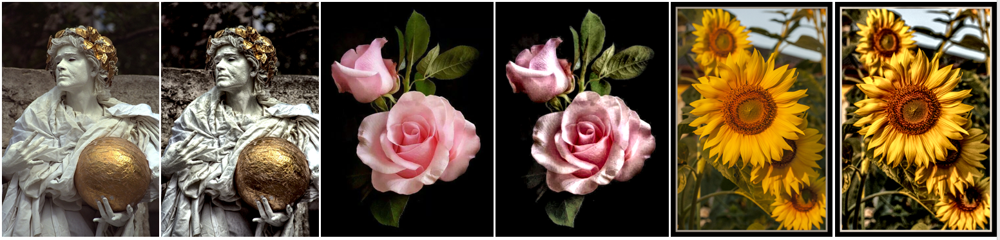
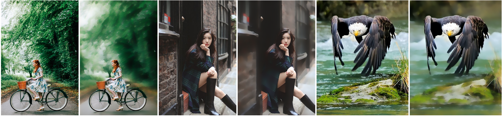
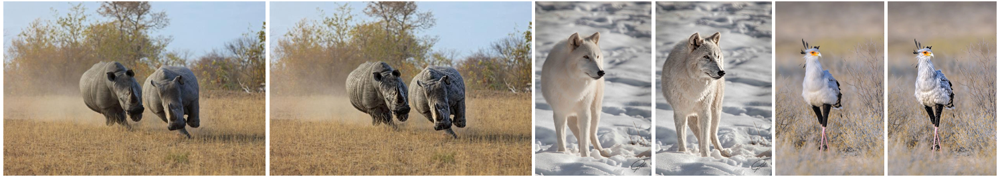

Image Smoothing via Unsupervised Learning
=======

This is the implementation of SIGGRAPH Asia 2018 paper *"Image Smoothing via Unsupervised Learning"* by [Qingnan Fan](<https://fqnchina.github.io/>), *et al.*

Our work is the first unsupervised learning approach for the image smoothing problem. Our proposed objective function can be slightly modifed to achieve different image processing effects, for example, 

Edge-preserving smoothing

Image abstraction

Detail enhancement

Background smooth

Foreground enhancement


## Getting Started

This paper is implemented with Torch framework.

Compilation
----

Our codes are implemented in Torch framework. Some self-defined layers are included in the '**compilation**' folder. Before testing or training the models, you need to install the latest torch framework and compile the ***.lua** under the nn module, the ***.cu** and ***.h** under the cunn module, and **adam_state.lua** under optim module.

To be specific, the lua files have to be put in **./torch/extra/nn/** module directory, and editing **init.lua** file to include the corresponding file. Finally run the command under nn directory, **luarocks make ./rocks/nn-scm-1.rockspec**. Then nn module will be independently compiled. 

Similarly for the cuda files, they need to be put into **./torch/extra/cunn/lib/THCUNN/** module directory, then editing the **./torch/extra/cunn/lib/THCUNN/generic/THCUNN.h** to include the corresponding files, and finally run the command **luarocks make ./rocks/cunn-scm-1.rockspec** under **./torch/extra/cunn** folder to compile them. 

Accordingly, the adam lua file has to be put in **./torch/pkg/optim**, edit the **init.lua** file and then run **luarocks make optim-1.0.5-0.rockspec**.

Data Generation
----

Run **run_edgedetector.lua** to compute the edges for edge-preserving smoothing or texture removal. To learn the content-aware image smoothing effects, we need saliency map for each training sample, which could be generated by existing saliency prediction methods.

Training
----

The trained models are all in the **netfiles** folder.

Run **train_*.lua** to learn specific smoothing effects.

Evaluation
----
To test our trained model, run **test_smooth.lua**.

For the application of stylization, run **post_stylization.m** after predicting the smooth images. Similarly, for detail enhancement, run **post_detail_enhance.m**.

Cite
----

You can use our codes for research purpose only. And please cite our paper when you use our codes.
```
@Article{fan2018smoothing,
Title = {Image Smoothing via Unsupervised Learning},
Author = {Qingnan Fan and Jiaolong Yang and David Wipf and Baoquan Chen and Xin Tong},
Journal = {ACM Transactions on Graphics (Proceedings of SIGGRAPH ASIA 2018)},
Year = {2018},
Volume = {37}
Number = {6},
}
```
Contact
-------

If you find any bugs or have any ideas of optimizing these codes, please contact me via fqnchina [at] gmail [dot] com
